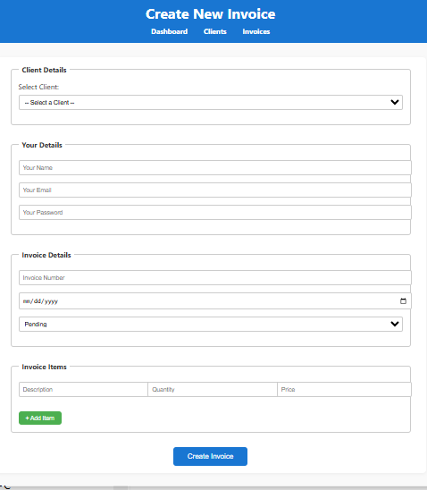
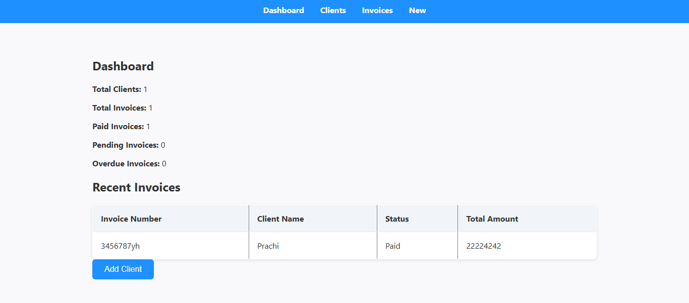

# 🧾 Invoice Generator Web App

A simple and intuitive invoice management application built with **Node.js**, **Express**, **MongoDB**, and **EJS**. It allows users to create, view, edit, and delete invoices, as well as manage client information with ease.

---

## 🚀 Features

- 📄 Create, read, update, and delete invoices
- 👥 Add new clients or select existing ones
- 💰 Auto-calculate line items and total amounts
- 📆 Manage invoice date and status (Paid, Pending, Overdue)
- 🖊️ Edit invoices dynamically
- 🔐 Associate invoices with users (basic user tracking)
<<<<<<< HEAD
- (Currently mocked or hardcoded. Login system planned in future enhancements.)

=======
- 🔐 Associate invoices with users (currently mocked — full login system coming soon)
>>>>>>> 25b4db0 (Updated README with structure and added images folder)

---

## 🛠️ Tech Stack

- **Backend:** Node.js, Express.js
- **Database:** MongoDB with Mongoose
- **Frontend:** EJS Templates, HTML5, CSS3, Vanilla JavaScript
- **Templating Engine:** EJS

---

## 📁 Folder Structure

```
InvoiceGenerator/
│
├── config/                  # MongoDB connection setup
│   └── mongoose.js
│
├── controllers/            # Business logic and DB interactions
│   └── init.js             # Optional: initial seed data
│
├── models/                 # Mongoose schemas
│   ├── client.js
│   ├── invoice.js
│   └── user.js
│
├── public/                 # Static files
│   └── css/
│       ├── dashboard.css
│       ├── clients.css
│       ├── invoice.css
│       ├── new.css
│       ├── edit.css
│       └── view.css
│
├── routes/                 # Express route handlers
│   ├── clientRoutes.js
│   └── invoiceRoutes.js
│
├── views/                  # EJS templates
│   ├── dashboard.ejs
│   ├── clients.ejs
│   ├── invoices/
│   │   ├── new.ejs
│   │   ├── list.ejs
│   │   ├── edit.ejs
│   │   └── view.ejs
│   └── partials/           # Reusable UI parts like nav, footer
│
├── server/
│   └── index.js            # Main server entry point
│
├── .env                    # Environment variables (ignored in git)
├── .gitignore              # Files/folders excluded from Git
├── package.json
└── README.md
```

---

## ⚙️ Setup Instructions

### 1. Clone the Repository

```bash
git clone https://github.com/yourusername/InvoiceGenerator.git
cd InvoiceGenerator
```

### 2. Install Dependencies

```bash
npm install
```

### 3. Configure Environment Variables

Create a `.env` file in the root of the project:

```env
PORT=8080
MONGODB_URI=mongodb://localhost:27017/invoice_app
```

### 4. Start the Server

```bash
nodemon server/index.js
```

Then open your browser and visit:  
📍 `http://localhost:8080`

---
### 🔗 Live Demo

Check out the live app here: [Invoice Generator App]([https://your-live-link.com](https://invoice-generator-95re.onrender.com))


### 🔗 Live Demo

Check out the live app here: [Invoice Generator App](https://invoice-generator-95re.onrender.com)

## 📸 Screenshots

### 📋 Invoice Form

  
_Easily create invoices with dynamic line item calculation._

### 📊 Dashboard View

  
_Quick overview of all your invoices and their statuses._

## 🧾 Sample Usage

- Go to `/invoices/new` to create a new invoice.
- View, edit, or delete existing invoices from the dashboard.
- Add new clients directly from the invoice form if not already listed.
- All invoice items and totals are calculated automatically.

---

## 📌 .gitignore Includes

```gitignore
node_modules/
.env
```

> Make sure to remove them from Git tracking if already committed using:
>
> ```bash
> git rm -r --cached node_modules
> git rm --cached .env
> ```

---

## 💡 Future Enhancements

- Authentication system (login/register)
- PDF invoice generation
- Email invoices to clients
- Improved validations

---

## 📬 Contact

Made with ❤️ by Prachi Yadav

> Feel free to fork this repo or open an issue if you’d like to contribute or have suggestions!

## 🪪 License

MIT — Copyright © 2025 Prachi Yadav
See [LICENSE](./LICENSE) for full text.
